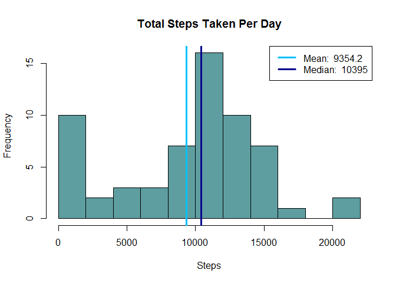
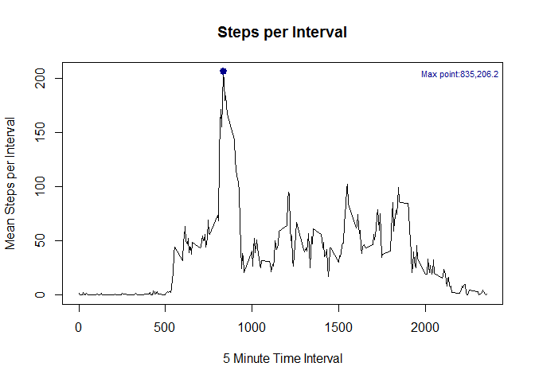
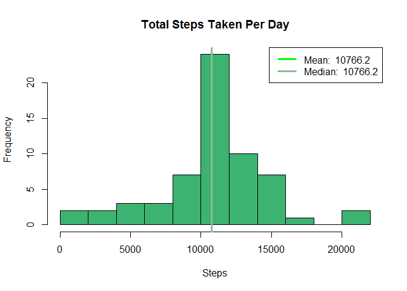
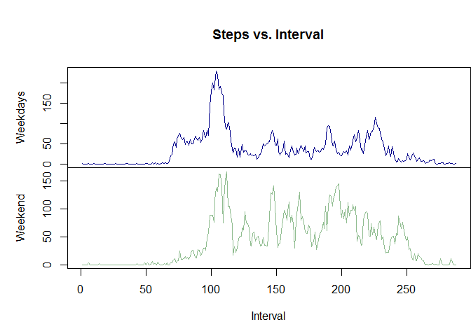

# Reproducible Research: Peer Assessment 1
Fernando Alfaro  
#Setup Environment
Assuming that we are on the working directory where the data source is. 

1.  Loading required libraries or install it if not present
2.  Removes all variables from environment


```r
rm(list=ls(all=TRUE)) 
```


## Loading and preprocessing the data

From the assignment instructions:

>   *This assignment makes use of data from a personal activity monitoring device. This device collects data at 5 minute intervals through out the day. The data consists of two months of data from an anonymous individual collected during the months of October and November, 2012 and include the number of steps taken in 5 minute intervals each day.*

The data is compressed so we need to unzip the file, read the CSV file into a data frame and inspect the structure of the data.


```r
if (file.exists("activity.zip")) { 
    unzip (zipfile="activity.zip")
    data = read.csv('activity.csv', header = T)
    names(data)
    str(data)
    head(data)
    }
```

```
## 'data.frame':	17568 obs. of  3 variables:
##  $ steps   : int  NA NA NA NA NA NA NA NA NA NA ...
##  $ date    : Factor w/ 61 levels "2012-10-01","2012-10-02",..: 1 1 1 1 1 1 1 1 1 1 ...
##  $ interval: int  0 5 10 15 20 25 30 35 40 45 ...
```

```
##   steps       date interval
## 1    NA 2012-10-01        0
## 2    NA 2012-10-01        5
## 3    NA 2012-10-01       10
## 4    NA 2012-10-01       15
## 5    NA 2012-10-01       20
## 6    NA 2012-10-01       25
```
The variables included in this data set are:

*   **steps:** Number of steps taking in a 5-minute interval (missing values are coded as NA)
*   **date:** The date on which the measurement was taken in YYYY-MM-DD format
*   **interval:** Identifier for the 5-minute interval in which measurement was taken

## What is mean total number of steps taken per day?

To answer this question we need to get the sum of the steps taken per day so we can calculate the mean. Generating a histogram to check if the total number of step per day has a normal distribution and see how close the median and the mean are will help us see if the mean is a representative number of the daily step or if too many outliers make the mean irrelevant.


```r
stepsPerDay <- tapply(data$steps, data$date, sum, na.rm = TRUE)

hist(stepsPerDay,
     main="Total Steps Taken Per Day",
     xlab="Steps",
     col = "cadetblue",
     breaks = 10)
     
meanStepsPerDay <- round (mean(stepsPerDay),1)
medianStepsPerDay <- round (median(stepsPerDay),1)

abline(v=meanStepsPerDay, lwd = 3, col = 'deepskyblue')
abline(v=medianStepsPerDay, lwd = 3, col = 'darkblue')
        
legend('topright', 
       lty = 1, 
       lwd = 3, 
       col = c("deepskyblue", "darkblue"),
       legend = c(paste('Mean: ', meanStepsPerDay),
                  paste('Median: ', medianStepsPerDay)
                  )
   )
```

<!-- -->


**ANSWER:** The mean total number of steps taken per day is **9354.2**. The histogram shows a reasonable distribution where the mean and median are close enough to consider the mean representative of the daily activity.

***

## What is the average daily activity pattern?

To answer this we need to calculate the average stepes per interval and find the maximun number.


```r
interval <- unique(data$interval)
stepsByInterval <- tapply(data$steps, data$interval, mean, na.rm=T)
plot(interval,stepsByInterval, type="l",
     main="Steps per Interval",
     xlab="5 Minute Time Interval",
     ylab="Mean Steps per Interval")
maxStepInterval <- names(which.max(stepsByInterval))
stepsInterval <- max(stepsByInterval)

#Collect Cooridinates of The Max Interval For Graphing
points(maxStepInterval,  stepsInterval, col = 'darkblue', lwd = 3, pch = 19)

msg <- paste( 'Max point:', maxStepInterval ,',', round(stepsInterval, 1), sep = '')

legend("topright",
       legend = msg,
       cex=.7,
       text.col = 'darkblue',
       bty = 'n'
       )
```

<!-- -->


**ANSWER:** The interval **835** is the one with a maximum averaged number of steps of **206.2**.


## Imputing missing values

First we find the total missing values


```r
naIndex <- is.na(data$steps)
Missing <- sum(naIndex)
```
The number of missing values is **2304**. One approache will be replacing the missing values with zeros but this will squeue the data towards lower values. A better approache will be replacing the missing data with the mean value on the same time interval, across all days.


```r
dataNoNa <- data
dataNoNa$steps[which(naIndex)] <- stepsByInterval[match(data$interval[which(naIndex)], interval)]

stepsPerDayNoNa <- tapply(dataNoNa$steps, dataNoNa$date, sum, na.rm = TRUE)

hist(stepsPerDayNoNa,
     main="Total Steps Taken Per Day",
     xlab="Steps",
     col = "mediumseagreen",
     breaks = 10)


meanStepsPerDayNoNa <- round(mean(stepsPerDayNoNa),1)
medianStepsPerDayNoNa <- round(median(stepsPerDayNoNa),1)


abline(v=meanStepsPerDayNoNa, lwd = 3, col = 'green')
abline(v=medianStepsPerDayNoNa, lwd = 3, col = 'darkseagreen')
        
legend('topright', 
       lty = 1, 
       lwd = 3, 
       col = c("green", "darkseagreen"),
       legend = c(paste('Mean: ', meanStepsPerDayNoNa),
                  paste('Median: ', medianStepsPerDayNoNa)
                  )
   )
```

<!-- -->


The mean number of steps per days, after remplacing missing data, is **1.07662\times 10^{4}** and the median number is pretty much the same  **1.07662\times 10^{4}**. this indicates that the distribution has not changed drastically and the gap between the mean and the mediam has closed.


## Are there differences in activity patterns between weekdays and weekends?

We can create a function that looks returns if the date is a week day or a weekend.


```r
weekpart = function(d){
        dayName = weekdays(as.Date(d))
        if(dayName %in% c('Saturday', 'Sunday')){
                return('Weekend')
        }
        return('Weekday')
}

dataNoNa$dayType = as.factor(apply(as.matrix(dataNoNa$date),1,weekpart))

stepsByIntervalNoNa <- with(dataNoNa, tapply(steps, list(interval, dayType), mean))

par(mfrow = c(2,1))
with(dataNoNa, {
    
  par(mai=c(0,1,1,0))
    
  plot(stepsByIntervalNoNa[,"Weekday"], 
       type="l", 
       main=("Steps vs. Interval"), 
       xaxt='n', 
       ylab="Weekdays", 
       col= "darkblue")

  par(mai=c(1,1,0,0))
  
  plot(stepsByIntervalNoNa[,"Weekend"], 
       type="l",
       xlab="Interval",
       ylab="Weekend", 
       col = "darkseagreen")
})
```

<!-- -->

The plot shows some interesting patters:

1.  Weekend activity starts to pick latter that weekdays. Must be people sleepling a bit more before starting the day
2.  There is more activity (steps) during the weekend with higher and more frequent picks. People are more active and move more during the weekend


